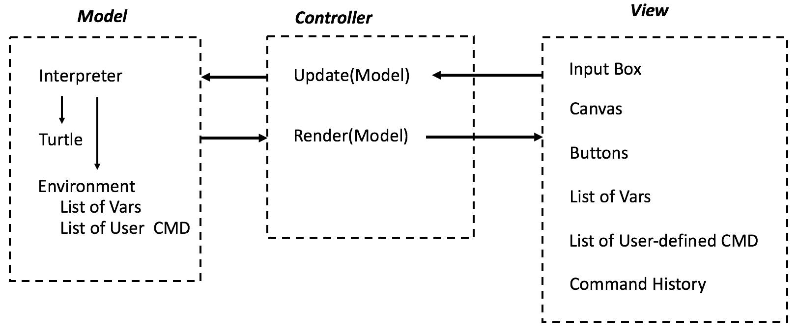
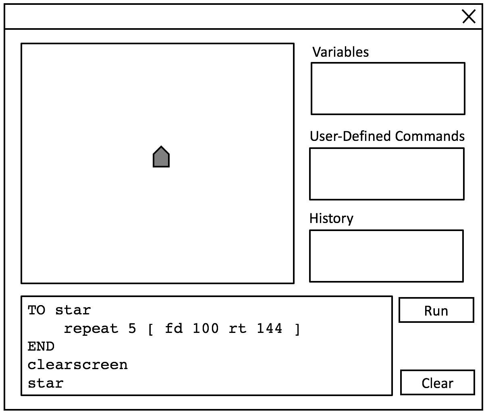

# Design for SLogo

### Introduction
SLogo is an implementation of a simplified version of Logo, or "Simple Logo". It includes the most commonly used features in Logo and can be used to provide an introduction to computer programming.  Our program will be split into modules of Model, Controller and View so that we can split into subteams and work concurrently.

#### Design Overview Diagram

### Design Overview

+ Main
    * Would initialize the model and view to start the program.

+ Model
	* Interpreter
    	* Parses the the script text to inistatiate a list of Commands. The script text handles i18n using properties resource file to get translation.
    	* Command is a class with a method member called execute(). A user-defined Command extends Command and essentailly encapsolates a list of other Commands, with its own stack frame and argument lists.
    	* Loops are also implemented this way, except using its parent's stack frame and no argument lists.
    * InstructionCache
    	* A list of Commands parsed by the Interpreter with an Main entry.
    * Executor
    	* Executes a given InstructionCache and update log, vars, history, and user commands.
    * Turtle Log
    	* The execution of each command potentially changes the state of the turtle, moving, turning, etc. Such updates are recorded in order in an append-only log. When the script is done executing, this log is passed to frontend, which will animates the turtle actions in sequence. 
    * Environment
    	* Record the list of global vars, list of user defined commands, and all command history as the script executes.
    * Update()
    	* The public API of the model for the frontend to pass the user input script or update its states listed above. 
    	* Render Callback
    		* An asynchrous communication paradigm between Model and View. When View updates the model, instead of periodic polling the model to see if execution finishes, the View knows that when scipt execution finishes, model will call render APIs on View to update the view, an interrupt if you will. 

+ Controller
	* Coordinates the workflow between each Model sub-component. Execute such workflow when View passes in a raw script and after model done parsing and executing call renders of View with appropriate params to update frontend. 

+ View
    * Scipt Editor
    	* Syntax Highlighting, copy and pasting, etc. 
    * Buttons
    	* Run, clear, etc.
    * Canvas
    	* The playground for the turtle that captures all its drawings. 
    * List of global vars, list of user defined commands, and all command history
    	* Frontend representation of the the current states of the program. 
	* Might consist of different subclasses which each hold a different part of the view.
    
+ Exceptions
	* Exceptions generated during compile time or run time execution, such as UnrecognizedIdentifier, MissingParenthesis, OutOfCanvasBoarder, StackOverflow, TimeLimitedExceeded, etc. 

### User Interface
A UI mockup is shown in the picture below.

### API Details

+ Model
    * Turtle
        * TurtleState getState()
        * void setState(TurtleState state)
    * TurtleState
        * double setPositionX(double x)
        * double setPositionY(double y)
        * double setDirection(double degrees)
        * boolean setPen(boolean isDown)
        * boolean setVisible(boolean isVisible)
        * void setAnimate(boolean animate)
        * double getPositionX()
        * double getPositionY()
        * double getHeading()
        * boolean isPenDown()
        * boolean isVisible()
        * boolean doesAnimate()
    * TurtleLog<TurtleState>
        * void append(TurtleState state)
        * iterator<TurtleState>()
    * Command
        * void execute(Map<String,value> args)
        * private appendState(TurtleState state)
    * Interpreter
        * InstructionCache parseScript(String script)
    * InstructionCache
    	* Command issue()
    * Executor
    	* void execute(InstructionCache, vars, history, userCmds)
    	  // vars, history, userCmds are passed in to be modified
    * Environment
        * GlobalVars
            * boolean addVar(String name, ? value)
            * ? getValue(String name)
            * Map(name->value) getAll()
            * boolean remove(String name)
        * UserCommands
            * void addCommand(Command cmd)
            * Collection<Command> getAll()
        * CommandHistory
            * void addCommand(Command cmd)
            * List<Command> getAll()

+ View
    * Canvas
        * void render(TurtleLog log)
    * EnvironmentView
        * GlobalVarsView
            * void update(GlobalVars vars)
        * UserCommandsView
            * void update(UserCommandsView cmds)
        * CommandHistoryView
            * void update(CommandHistory history)
    * Editor
        * void setText(String text, ...style)
    * Console
        * void setText(String text, ...style)

* Controller
    * void runScript(String script)

### API Example Code

+ 'fd 50'
    
    Note: class after colon is the one calling. class with '.' is the one executing.
    * Controller.runScript(script) : View
    * InstructionCache <- Interpreter.parseScript(script) : Controller
    * turtleLog <- Executor.execute(InstructionCache, vars, history, userCmds) : Controller
    * View.render(turtleLog) : Controller
    * View.updateCommandHistory(commandList) : Controller
    * View.updateVariables(vars) : Controller
    * View.updateUserCommands(cmds) : Controller

+ Use case 'cm296' - Changing background color
    + The view takes care of this as this is not something the backend has to worry about.
    + View updates the color in the scene by calling a method within it to do that.

+ Use case 'hy103' - changing the image of the turtle
    + The image in TurtleView is updated with user's choice
    + View.render is called to update the view shown to the user

### Design Considerations 

We want to emphasize the modularity of this design. The entire View as a frontend representation of model is saparated from model and interfaced with it using a controller. The Controller coordinates the workflow between each Model sub-components such as Interpreter, Executor, InstructionCache, etc. The Model components on the other hand are all unaware of the existence of either the Controller or the View. Modularity as such makes the each module reusable without coupling with many other classes and testable without having to create multiple mocks to isolate external dependents' behavior. 

### Team Responsibilities

