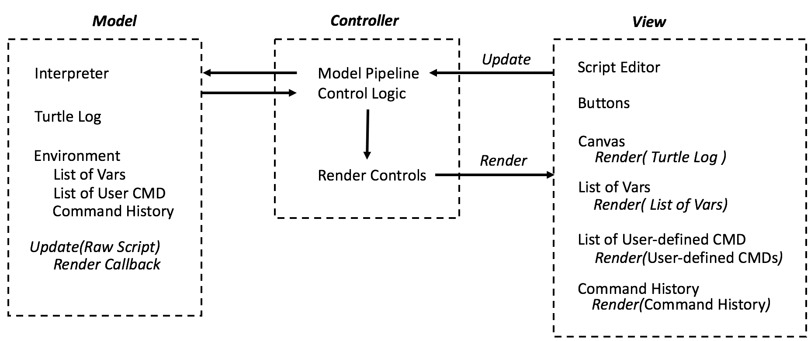

# Design for SLogo

### Design Overview

+ Main
    * Would initialize the controller and start the program.

+ Controller
    * Responsible for taking in input and passing it to the interpreter, after which it calls the view to update/render itself again.

+ Interpreter
    * Parses the command depending on which language the user chose and calls the corresponding action for the ViewObject.

+ View/User Interface
    * Renders the backend and displays all other information needed for the program. This will consist of different subclasses which each hold a different part of the view.

+ Actions
    
+ Exceptions

+ ViewObject
    * This is a superclass which represents any object on the viewing screen that the user can control. 
    * Turtle will be a subclass of this

#### Design Overview Diagram

    